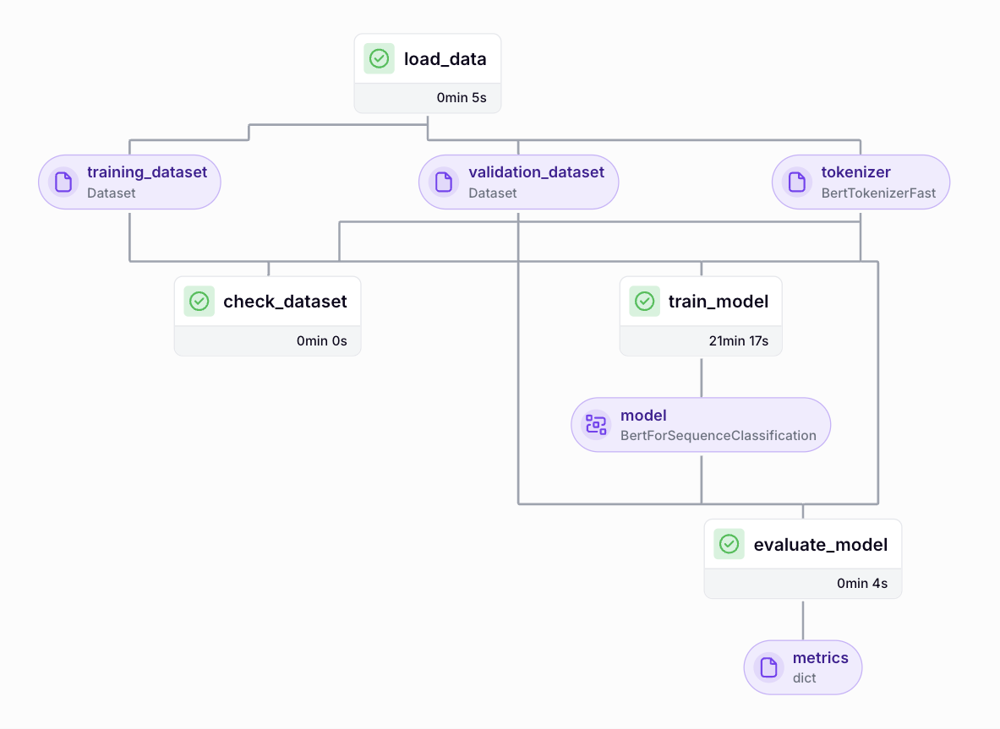

Reproducible PyTorch training pipeline with ZenML
-------------------------------------------------

This is a single- and multi- GPU training pipeline showcasing the use of ZenML,
Skypilot and HuggingFace Accelerate. For the task, a BERT model has been chosen
and trained on the SST-2 (Stanford Sentiment Treebank) dataset.

The pipeline is designed to run either locally or on AWS infrastructure without any code
changes\*, with support for multi-GPU training when available.

\*: _As of ZenML 0.74.0, accelerate decorator does not process passing complex
types to the training step, thus necessitating merging loading and training into
a single step for true reproducibility. Run.py demonstrates the original design
and the DAG you will see below; it will run locally and on a single-gpu 
instance like g4dn.xlarge. \_workaround.py represents the truly reproducible
code and will run on g4dn.12xlarge with 4 GPUs as well._


### The pipeline


<!-- <p align="center">
  
</p> -->

The pipeline consists of 3 main steps: `load_data`, `train_model` and `evaluate_model`.

#### load_data
HuggingFace datasets is utilized for loading the SST-2 datase, which is then
tokenzied with the help of transformers library and prepared in the PyTorch format.

#### train_model
Using the pre-trained `bert-base-uncased` checkpoint from the transformers library,
device placement and distributed training is accomplished with HuggingFace
Accelerate and the ZenML integration in the form of `@run_with_accelerate` decorator.

#### evaluate_model
Evaluation is performed with the help of evaluate library.


### How to run

#### Project structure
```
.
├── src/
│   ├── run.py              # Main entry point for running the pipeline
│   ├── pipeline.py         # Core pipeline implementation
│   ├── settings.py         # Configuration settings for Docker and AWS
│   └── materializers.py    # Minimal materializers for ZenML
├── pyproject.toml          # Poetry file with dependencies and metadata
└── README.md               # This file
```

#### Prerequisites
- Python 3.12
- Poetry
- MPS-enabled MacBook (for local GPU support)

> ⚠️ **Note**
> 
> Running this pipeline on AWS requires a ZenML server deployment which is out of
> scope of this guide. You can still run this code locally if you have an MPS
> enabled Macbook (Apple Silicon) using the following instructions.

#### Steps
1. Install project dependencies:
    ```bash
    poetry install
    ```
2. Enter the venv:
    ```bash
    poetry shell
    ```
3. Install ZenML integrations:
    ```bash
    zenml integration install aws skypilot_aws
    ```
4. Start a local ZenML server:
    ```bash
    OBJC_DISABLE_INITIALIZE_FORK_SAFETY=YES zenml login --local

    # context: https://stackoverflow.com/questions/73638290/python-on-mac-is-it-safe-to-set-objc-disable-initialize-fork-safety-yes-globall
    ```
5. Everything is ready! Run the pipeline with:
    ```bash
    python src/run.py
    ```
6. Explore the pipeline run visually by following the returned dashboard url:
    ```bash
    # http://127.0.0.1:8237/...
    ```
7. Clean up – the following command shuts down the local ZenML server:
    ```bash
    zenml logout --local
    ```

### Review

Training times on different hardware:
- M2 Mac: 1h23m
- g4dn.2xlarge: 34m
- g4dn.12xlarge (4 GPUs): 21m

Pros: 
- Low cloud cost – incurring EC2 charges only, due to using the free Skypilot orchestrator and the Open Source version of ZenML.
- Reproducible on different hardware: cloud-local, single-multi GPU, cross-cloud.

Cons:
- Both ZenML and Skypilot are immature pre-1.0 products with the associated
pain points.
- More DIY required compared to the commercial leaders like Anyscale.
- Scaling Skypilot horizontally is not supported by ZenML (but is in development at the time of this writing).


Disclaimer
----------

`pipeline.py` and `settings.py` were predominantly human written while
referencing the HuggingFace LLM course; `materializers.py` and `run.py` are
predominantly AI generated. This README file is the result of a mix of both
approaches.


References
----------

- [HuggingFace LLM Course](https://huggingface.co/learn/llm-course/)
- [ZenML](https://docs.zenml.io/)
- [SkyPilot](https://docs.skypilot.co/)
